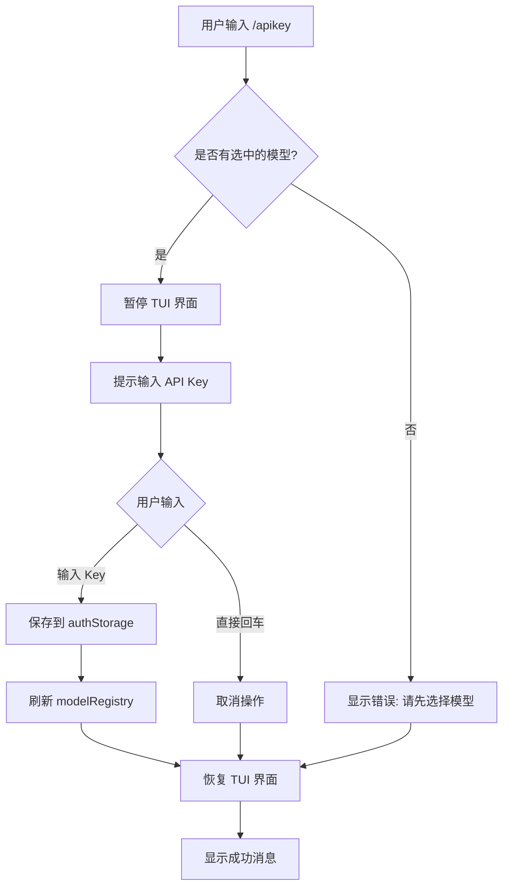

# NanoPencil API Key 管理改进

## 问题

之前用户输入 API Key 后，没有提供修改 API Key 的界面入口。如果用户需要：
- 更换 API Key
- 修复输入错误的 API Key
- 切换到不同的账号

只能手动编辑 `~/.nanopencil/agent/auth.json` 文件，非常不便。

## 解决方案

添加了 `/apikey` 斜杠命令，允许用户在交互界面中直接更新 API Key。

## 实现细节

### 1. 新增文件

**`modes/interactive/components/apikey-input.ts`**
- 提供 `promptForApiKey()` 函数
- 使用 Node.js readline 模块获取用户输入
- 返回输入的 API Key 或 null（用户取消）

### 2. 修改文件

**`core/slash-commands.ts`**
- 在内置命令列表中添加 `/apikey` 命令
- 描述: "Update API key for current provider"

**`modes/interactive/interactive-mode.ts`**
- 导入 `promptForApiKey` 函数
- 在 `setupEditorSubmitHandler()` 中添加 `/apikey` 命令处理
- 新增 `handleApiKeyCommand()` 方法：
  1. 检查当前选中的模型
  2. 获取模型对应的提供商
  3. 暂停 TUI 界面
  4. 提示用户输入新的 API Key
  5. 保存到 `authStorage`
  6. 刷新 `modelRegistry`
  7. 恢复 TUI 界面
  8. 显示成功/失败消息

**`modes/interactive/components/index.ts`**
- 导出 `promptForApiKey` 函数

### 3. 新增文档

**`docs/API密钥命令.md`**
- 完整的使用说明
- 支持的提供商列表
- 故障排除指南

## 使用流程



## 代码示例

### 用户交互

```
你: /apikey

[TUI 暂停]

请输入 Dashscope-coding API Key (留空取消): sk-sp-xxxxxxxxxxxx

[TUI 恢复]

✓ Dashscope-coding API Key 已更新
```

### 内部处理

```typescript
private async handleApiKeyCommand(): Promise<void> {
  const currentModel = this.session.model;
  if (!currentModel) {
    this.showError("No model selected...");
    return;
  }

  const provider = currentModel.provider;
  
  this.ui.stop();  // 暂停 TUI
  
  const apiKey = await promptForApiKey({
    prompt: `请输入 ${providerName} API Key (留空取消)`
  });
  
  if (apiKey) {
    this.session.authStorage.set(provider, {
      type: "api_key",
      key: apiKey
    });
    this.session.modelRegistry.refresh();
    this.showStatus(`${providerName} API Key 已更新`);
  }
  
  this.ui.start();  // 恢复 TUI
  this.ui.requestRender(true);
}
```

## 优势

1. **用户友好**: 无需手动编辑配置文件
2. **即时生效**: 修改后立即刷新，无需重启
3. **智能识别**: 自动使用当前模型对应的提供商
4. **安全取消**: 支持取消操作，避免误操作
5. **多提供商支持**: 适用于所有配置的模型提供商

## 测试建议

1. 测试没有选中模型时的情况
2. 测试输入空值（取消操作）
3. 测试输入有效的 API Key
4. 测试各个不同的提供商（anthropic, openai, dashscope-coding, qianfan-coding, ark-coding 等）
5. 验证 auth.json 文件正确更新
6. 验证更新后可以正常使用模型

## 未来改进

1. 支持指定提供商: `/apikey <provider>` (例如 `/apikey anthropic`)
2. API Key 验证: 输入后立即验证格式是否正确
3. 显示当前 API Key 的部分信息（如 `sk-sp-...xxxx`）
4. 支持删除 API Key
5. 支持多个 API Key 的管理（为不同账号切换）

## 相关 Issue

解决用户反馈的"输入完 API Key 后无法修改"的问题。
