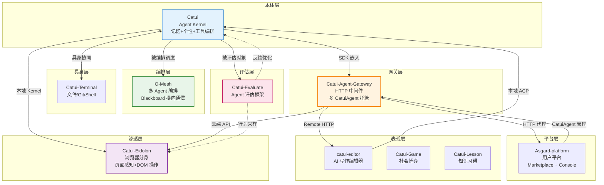

# §3 项目关联关系

> 项目间依赖、调用、协作的完整矩阵

<!--
[WHO]  项目间关联关系定义
[FROM] agent-projects-relations.md + PROJECT_OVERVIEW.md §七 + catui-platform-charter.md
[TO]   各项目集成文档、架构设计
[HERE] charter/03-relations.md — 关联关系
-->

---

## 3.1 核心依赖链

```
O-Mesh (编排) → Catui (执行) → Catui-Evaluate (评估) → 反馈优化
Catui-Eidolon (浏览器宿主) ← Catui (本地 Kernel) / Gateway (云端 API)
```

## 3.2 关联矩阵

| 源项目 | 目标项目 | 关系类型 | 说明 |
|--------|----------|----------|------|
| Asgard-platform | Catui-Agent-Gateway | 服务消费 | 通过 OpenAI Compatible API 调用 |
| Asgard-platform | Catui | 实例管理 | 配置和管理多个 CatuiAgent 实例 |
| Catui | Catui-Agent-Gateway | SDK 嵌入 | `@catui/agent` 被 Gateway import |
| Catui | O-Mesh | 被编排节点 | 作为 Agent 节点被 O-Mesh 调度 |
| Catui | Catui-Evaluate | 被评估对象 | Agent 能力量化评估 |
| Catui | Catui-Terminal | 具身协同 | Terminal 提供物理世界操作能力 |
| O-Mesh | Catui-Agent-Gateway | 任务分发 | 复杂任务分解后通过网关分发 |
| Catui-Evaluate | Catui | 反馈优化 | 评估结果驱动本体进化 |
| Catui-Eidolon | Catui | 本地 Kernel 消费 | Native Messaging / ACP 调用 |
| Catui-Eidolon | Catui-Agent-Gateway | 云端 API 消费 | OpenAI 兼容接口调用 |
| Catui-Eidolon | Catui-Terminal | 能力互补 | 浏览器 DOM + 本地 Shell 构成完整具身 |
| Catui-Eidolon | Catui-Evaluate | 行为采样 | 浏览器场景中的 Agent 表现评估 |
| catui-editor | Catui | ACP 调用 | 本地模式通过 ACP 直连 CLI |
| catui-editor | Catui-Agent-Gateway | HTTP 调用 | 远程模式通过 OpenAI API |
| Catui-Game | Catui / Gateway | Agent 接入 | 游戏中的 AI 角色通过 Gateway 调用 |
| Catui-Lesson | Catui / Gateway | Agent 接入 | 学习场景中的 AI 辅导 |

## 3.3 关联关系图



## 3.4 关键协作模式

### 模式 A：单 Agent 深度任务

```
用户 → Catui CLI → 编码实现 → Catui-Evaluate 评估 → 反馈优化
```

### 模式 B：多 Agent 协作开发

```
用户 → O-Mesh Orchestrator
    ├──→ Node1 (Catui): 设计数据库 Schema
    ├──→ Node2 (Catui): 实现 API 接口（依赖 Node1）
    ├──→ Node3 (Catui): 编写单元测试
    └──→ Node4 (catui-editor): 撰写 API 文档
    ↓
Blackboard 共享 Schema 定义
    ↓
Catui-Evaluate 评估各节点输出
```

### 模式 C：浏览器渗透交互

```
用户在任意网页打开 Eidolon Side Panel
    ↓
Eidolon 读取当前页面 DOM 上下文
    ↓
本地模式: Native Messaging → Catui（记忆 + 推理）
云端模式: OpenAI 兼容 API → Gateway → CatuiAgent
    ↓
返回推理结果或页面动作意图
    ↓
Eidolon 按 origin 权限执行 DOM 动作，Side Panel 反馈结果
```

### 模式 D：平台服务化

```
用户 → Asgard Marketplace → 选择/创建 CatuiAgent
    ↓
Asgard → Gateway 创建实例（catui-agent SDK + Soul + Memory）
    ↓
用户通过 Chat / Console 与 CatuiAgent 对话
    ↓
Asgard 记录用量 / 计费
```

## 3.5 技术对接点

| 对接项目 | 接口/协议 | 说明 |
|---------|----------|------|
| Catui ↔ Gateway | SDK import | Gateway import `@catui/agent` |
| Catui ↔ O-Mesh | CLI / Stream JSON | O-Mesh Runner 调用 Catui CLI |
| Catui ↔ Catui-Evaluate | Python SDK | Evaluate 调用 Catui 进行测试 |
| Catui ↔ Eidolon | Native Messaging / ACP | 浏览器插件调用 Catui 作为本地 Brain |
| Catui ↔ Browser Harness | CDP / Python CLI | 通用浏览器工具层（非 Eidolon 场景） |
| Gateway ↔ Asgard | HTTP 代理 | Asgard 通过 HTTP 路由到 Gateway |
| Gateway ↔ Editor | HTTP + SSE (OpenAI Compatible) | 远程模式标准 API |
| Gateway ↔ Eidolon | HTTP + SSE (OpenAI Compatible) | 云端模式标准 API |
| Gateway ↔ Channel | 钉钉 Stream / WeChat XML / Feishu 事件 | IM 集成 |
| 跨项目通信 | Blackboard (KV + pub/sub) | O-Mesh 提供的横向通信机制 |
